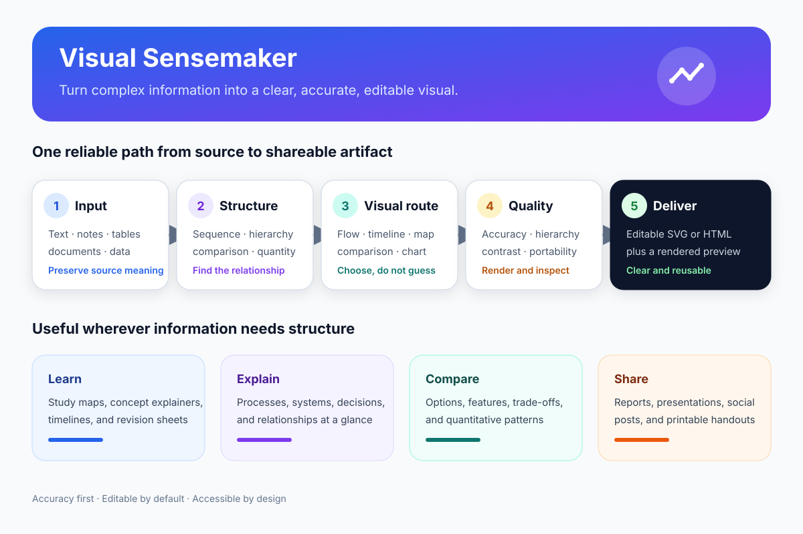
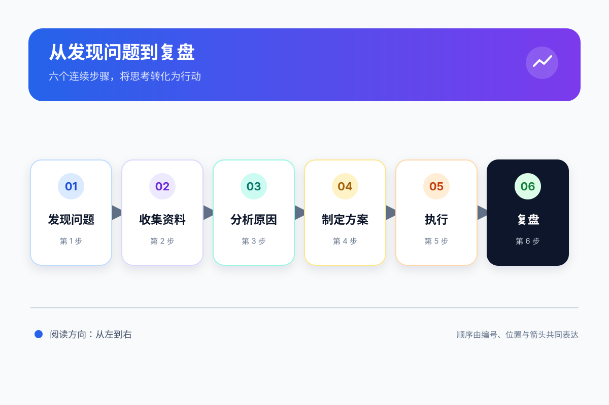
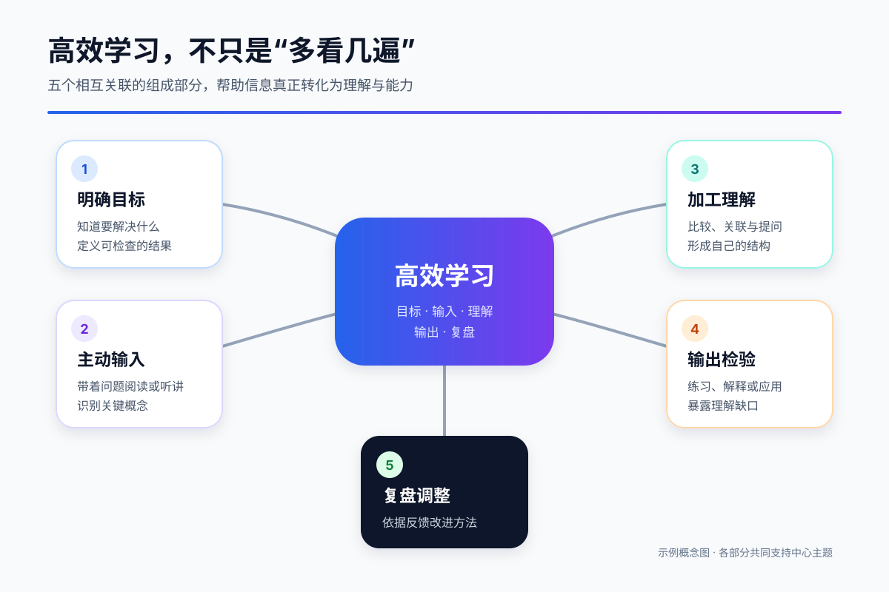
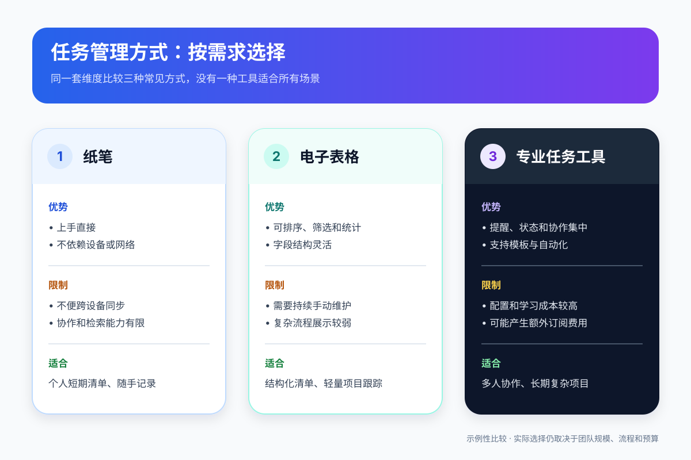

# Visual Sensemaker

[English](README.md) | [简体中文](README.zh-CN.md)

[](https://github.com/wyg0710/visual-sensemaker/actions/workflows/ci.yml)

Turn text, notes, tables, documents, and structured data into clear, accurate, editable visual explanations.



## See what it makes

All examples below are editable, dependency-free SVG files produced from ordinary-language requests.

| Flowchart | Concept map | Comparison |
|---|---|---|
| [](examples/problem-solving-process.svg) | [](examples/learning-concept-map.svg) | [](examples/task-tool-comparison.svg) |
| Preserve a sequence | Reveal related concepts | Compare shared criteria |

## Try it in one prompt

```text
Use $visual-sensemaker to turn "identify the problem → gather information → analyze causes → develop a plan → execute → review" into a clear, editable SVG flowchart.
```

Visual Sensemaker is an Agent Skill that chooses a visual structure from the relationships in the source material. Users can describe the outcome in ordinary language instead of deciding whether they need a flowchart, timeline, comparison, hierarchy, concept map, or data chart.

## Why it exists

Visual generation often fails in two ways: a polished graphic changes the source meaning, or an accurate graphic is too dense to understand. This skill treats semantic fidelity, visual routing, accessibility, and render inspection as one workflow.

## More example prompts

```text
Use $visual-sensemaker to turn these meeting notes into a decision flowchart.
```

```text
Use $visual-sensemaker to compare the three plans in this table and create an editable visual.
```

```text
Use $visual-sensemaker to turn this chapter into a one-page concept map for revision.
```

```text
Use $visual-sensemaker to inspect this CSV, choose an honest chart, and explain the main pattern.
```

## What it provides

- relationship-based routing across six visual structures;
- SVG-first editable output with HTML and Mermaid options;
- safeguards against invented facts and misleading quantitative encodings;
- portable layout, typography, color, and accessibility defaults;
- a dependency-free SVG structural checker;
- a rendered example and automated tests.

This is not a photo editor, illustration generator, CAD tool, or replacement for specialized domain plotting standards.

## Install in Codex

Ask Codex to install the current repository version:

```text
Use skill-installer to install the visual-sensemaker skill from the repository root:
https://github.com/wyg0710/visual-sensemaker
```

Or clone it into your Codex user skills directory:

```bash
git clone --depth 1 https://github.com/wyg0710/visual-sensemaker.git "${CODEX_HOME:-$HOME/.codex}/skills/visual-sensemaker"
```

For a reproducible installation, select a version from [Releases](https://github.com/wyg0710/visual-sensemaker/releases) and add `--branch <tag>`.

For a repository-scoped installation, copy or clone it to:

```text
<repository>/.agents/skills/visual-sensemaker/
```

Codex detects skill changes automatically. If it does not appear, restart Codex.

## Validate an SVG

Python 3.9 or newer is recommended. The checker uses only the standard library.

```bash
python scripts/check_svg.py examples/*.svg assets/*.svg
python -m unittest discover -s tests -v
```

The checker verifies XML structure, viewBox, accessibility metadata, duplicate IDs, broken references, remote resources, scripts, and several portability risks. It complements visual inspection; it does not replace rendering the artifact.

## Repository structure

```text
visual-sensemaker/
├── SKILL.md
├── agents/openai.yaml
├── assets/logo.svg
├── references/
├── scripts/check_svg.py
├── examples/
├── tests/
├── .github/workflows/ci.yml
├── README.md
└── LICENSE
```

## Contributing

Issues and pull requests are welcome. See [CONTRIBUTING.md](CONTRIBUTING.md) for the scope and verification expectations.

## License

MIT
