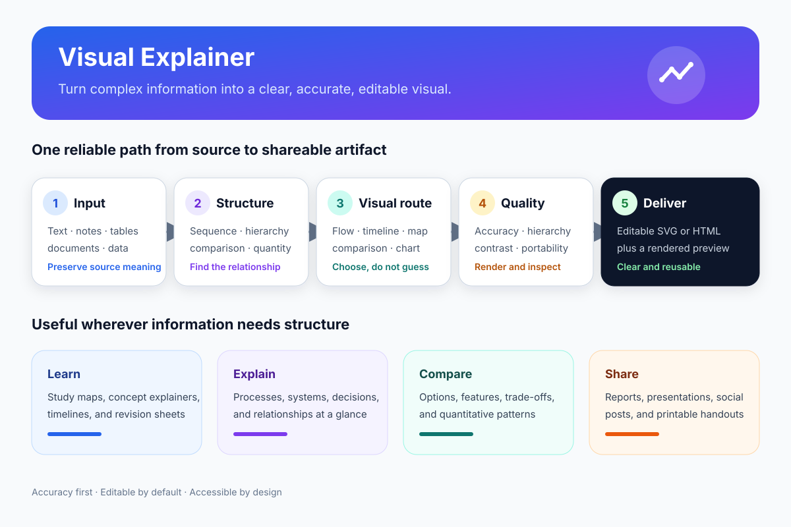

# Visual Explainer

[English](README.md) | [简体中文](README.zh-CN.md)

把文本、笔记、表格、文档和结构化数据转换成清晰、准确、可编辑的视觉解释图。



Visual Explainer 是一个 Agent Skill。它根据源信息中的关系自动选择视觉结构，因此用户可以直接描述目标，而不必预先判断应该使用流程图、时间线、对比图、层级图、概念图还是数据图表。

## 为什么需要它

视觉生成经常出现两个问题：图很漂亮，但改变了原始信息的含义；或者内容准确，却过于拥挤，难以理解。本 Skill 把语义忠实性、图形路由、可访问性和渲染检查放在同一套工作流程中。

## 使用示例

```text
使用 $visual-explainer 把这些会议记录转换成决策流程图。
```

```text
使用 $visual-explainer 比较表格中的三个方案，并生成可编辑的视觉图。
```

```text
使用 $visual-explainer 把这一章整理成一页复习概念图。
```

```text
使用 $visual-explainer 检查这个 CSV，选择不误导的图表并解释主要趋势。
```

## v0.1 提供的能力

- 根据关系类型在六类视觉结构之间自动路由；
- 默认输出可编辑 SVG，并可选择 HTML 或 Mermaid；
- 防止虚构事实和使用误导性的定量编码；
- 提供可移植的布局、字体、颜色和可访问性规则；
- 提供无第三方依赖的 SVG 结构校验器；
- 包含实际渲染示例和自动化测试。

它不是照片编辑器、艺术插画生成器、CAD 工具，也不能替代有严格领域规范的专业绘图软件。

## 安装到 Codex

将仓库克隆到用户级 Skill 目录：

```bash
git clone https://github.com/wyg0710/visual-explainer.git "$HOME/.agents/skills/visual-explainer"
```

如果只希望在一个仓库中使用，请复制或克隆到：

```text
<repository>/.agents/skills/visual-explainer/
```

Codex 通常会自动检测 Skill 变化；如果没有出现，请重启 Codex。

## 验证 SVG

建议使用 Python 3.9 或更高版本。校验器只使用 Python 标准库。

```bash
python scripts/check_svg.py examples/visual-explainer-workflow.svg
python -m unittest discover -s tests -v
```

校验器会检查 XML 结构、`viewBox`、可访问性信息、重复 ID、无效引用、远程资源、脚本和若干可移植性风险。它不能取代对最终渲染图的人工检查。

## 参与贡献

欢迎提交 Issue 和 Pull Request。贡献范围和验证要求见 [CONTRIBUTING.md](CONTRIBUTING.md)。

## 许可证

MIT
